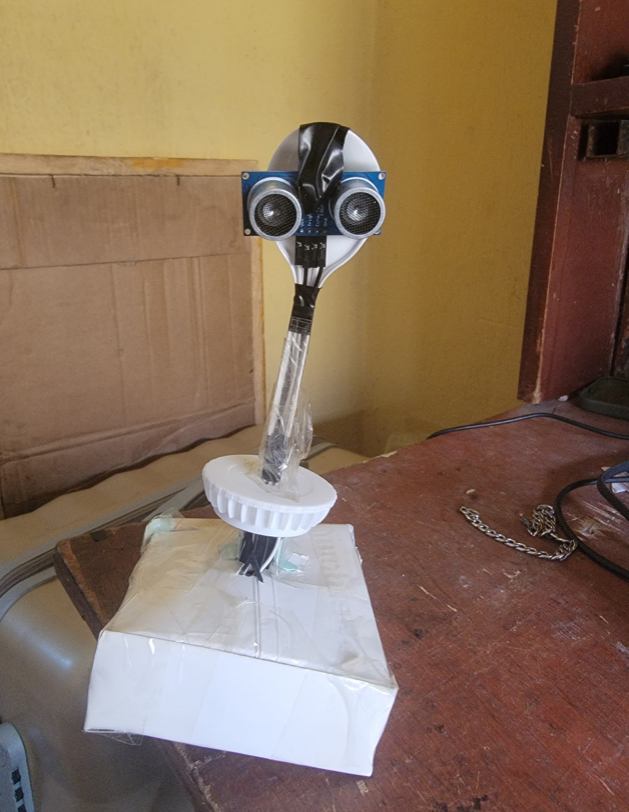
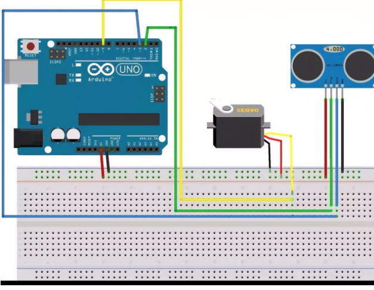
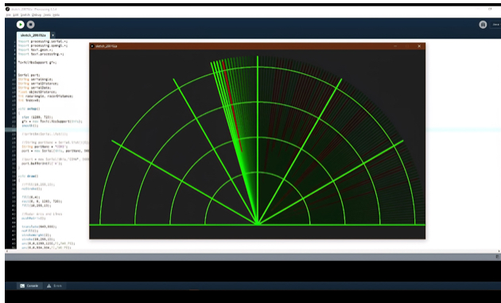

# Arduino Ultrasonic Radar System

## Overview

This project implements a radar-inspired environmental scanning system using:

- Arduino Uno
- HC-SR04 Ultrasonic Sensor
- SG90 Servo Motor
- Python
- Pygame

The sensor rotates between 0° and 180° while collecting distance measurements. Data is transmitted to a Python application that displays detected objects on a radar-style interface.

---

## Features

- Real-time radar scanning
- Servo-based sweep mechanism
- Target persistence
- Fading radar blips
- Distance labels
- Color-coded targets
- Duplicate target filtering
- Detection range filtering

---

## Hardware

- Arduino Uno
- HC-SR04
- SG90 Servo
- Breadboard
- Jumper Wires

---

## Software

 - Arduino IDE
 - python
 - pygame

---
 
### Arduino

Controls:

- Sensor measurements
- Servo movement
- Serial communication

### Python

Handles:

- Radar visualization
- Data filtering
- Target rendering

---

## Images

## Prototype

## Circuit Diagram

## Python

---

## Future Improvements

- 360° scanning
- Wireless communication
- OLED display
- Data logging
- Object tracking

---

## Author

Zephan Ovie Ufuoma
